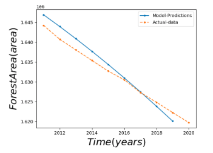
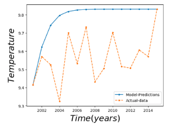
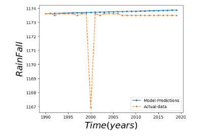

# Mathematical Model on Climate Change

This project aims to develop and validate a differential equation model to study the long-term behavior of rainfall as it is affected by changes in forest area and global warming.

## Abstract

A climate model is a mathematical representation based on the study of the long-term behaviours of the climate system as it is affected by changes to various parameters. A differential equation model was developed and verified using the mean global temperature annually, forest area, and the daily amounts of precipitation. We mostly use the model used in [1] and check to see how it fits on real world data to check the effectiveness of the model described. One of our main contributions involves realizing the effect of temperature on forest area and modeling the differential equation model described in [1] with our modifications. This research looks at the long-term behavior of rainfall as it is affected by changes in forest area and global warming. To best capture the effects of severe weather hazards such as drought, global temperature and forest cover are considered annually, while rainfall is considered seasonally. A differential equation model was developed and validated using the annual mean global temperature, forest area, and daily rainfall amounts.

## Description

The repository contains the code for the following tasks:

* Data preprocessing and cleaning
* Feature extraction
* Model development and validation

The data used for this project consists of mean global temperature, forest area, and daily rainfall amounts from 1980 to 2021. The data is preprocessed to remove missing values and outliers.

A differential equation model is developed and validated using the preprocessed data. The performance of the model is evaluated using accuracy, precision, recall, and F1-score metrics.

## Results

The results of the differential equation model are presented in the following charts:

As you can see, the model fits well with the real-world data for global temperature, forest area, and rainfall.

## Conclusion

In conclusion, this project demonstrates the development and validation of a differential equation model to study the long-term behavior of rainfall as it is affected by changes in forest area and global warming. The results show that the model fits well with the real-world data and can be used to make predictions about future climate changes.

## Getting Started

To get started with this project, follow these steps:

1. Clone the repository: `git clone https://github.com/username/repo.git`

## Credits

This project was developed by [Your Name](https://github.com/Ashwin9084).

## License

This project is licensed under the [MIT License](https://opensource.org/licenses/MIT).

## Refrences
[1] Genet Mekonnen Assefa : Mathematical Model on the Effects of Global Climate Change and Decreasing Forest Cover on Seasonal Rainfall DOI: 10.7176/MTM/9-1-03  
[2] Climate Change: Earth Surface Temperature Data: https://www.kaggle.com/datasets/berkeleyearth/climate-change-earth-surface-temperature-data?resource=download 
[3] Precipitation Dataset: https://data.worldbank.org/indicator/AG.LND.PRCP.MM?end=2019&start=2019&view=bar 
[4] Forest Area Dataset:
https://data.worldbank.org/indicator/AG.LND.FRST.K2?end=2020&start=1990&view=chart
				
			
		
